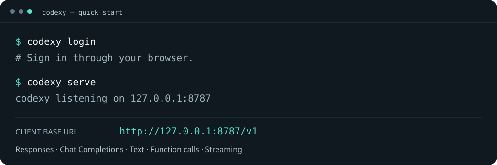

<p align="center">
  
</p>

<p align="center">
  <a href="https://github.com/smturtle2/codexy/actions/workflows/ci.yml"></a>
  <a href="https://github.com/smturtle2/codexy/releases/latest"></a>
  <a href="LICENSE"></a>
</p>

<p align="center">
  <a href="#빠른-시작">빠른 시작</a> ·
  <a href="#클라이언트-연결">클라이언트 연결</a> ·
  <a href="#지원-범위">지원 범위</a> ·
  <a href="docs/guide.md">상세 가이드</a> ·
  <a href="README.md">English</a>
</p>

**codexy**는 OpenAI 호환 클라이언트를 Codex 구독 백엔드에 연결하는 로컬 프록시입니다. 브라우저에서 로그인하고 Rust 실행 파일 하나를 시작하면 localhost로 요청을 보낼 수 있습니다.

- **브라우저 로그인** — Codex CLI 설치 없이 OAuth로 인증합니다.
- **익숙한 두 API** — Responses와 Chat Completions의 텍스트·함수 호출·스트리밍을 지원합니다.
- **단일 실행 파일** — Linux·macOS의 x86_64·ARM64 바이너리를 제공합니다.
- **세션 캐시 지원** — 캐시 키를 전달하고 캐시 토큰 사용량을 표시합니다.

<p align="center">
  
</p>

## 빠른 시작

Codex 구독 백엔드와 사용할 모델에 접근 가능한 ChatGPT 계정이 필요합니다. codexy는 OpenAI와 제휴하지 않은 독립 프로젝트입니다.

**1. 설치** — Linux 또는 macOS:

```sh
curl -fsSL https://raw.githubusercontent.com/smturtle2/codexy/main/scripts/install.sh | sh
```

설치 스크립트는 SHA-256을 검증하고 `~/.local/bin`에 설치합니다. 필요하면 해당 디렉터리를 `PATH`에 추가하세요. [릴리스](https://github.com/smturtle2/codexy/releases/latest)에서 직접 내려받을 수도 있습니다.

**2. 로그인하고 실행:**

```sh
codexy login
codexy serve
```

터미널을 열어 두세요. 기본 주소는 `127.0.0.1:8787`이며 `Ctrl+C`로 종료합니다.

**3. 다른 터미널에서 요청:**

```sh
curl http://127.0.0.1:8787/v1/responses \
  -H 'Content-Type: application/json' \
  -d '{"input":"Reply with exactly OK."}'
```

`model`을 생략하면 **`gpt-5.6-luna`**를 사용합니다. 모델 접근 권한은 계정에 따라 다르므로 필요하면 [설정](config.example.toml)의 `default_model`을 변경하세요.

업데이트할 때는 같은 설치 명령을 실행한 뒤 `codexy serve`를 재시작합니다.

## 클라이언트 연결

| 설정 | 값 |
| --- | --- |
| Base URL | `http://127.0.0.1:8787/v1` |
| 모델 | `gpt-5.6-luna` 또는 계정에서 사용할 수 있는 모델 |
| 로컬 API 키 | 불필요. 클라이언트가 입력을 요구하면 `local` 같은 임의 값을 사용 |

로컬 클라이언트의 인증 정보는 백엔드에 전달하지 않습니다. 로컬 사용에는 기본 루프백 주소를 유지하세요. 외부 접근에는 별도의 접근 제어와 TLS가 필요합니다.

<details>
<summary>Chat Completions 스트리밍 예제</summary>

```sh
curl -N http://127.0.0.1:8787/v1/chat/completions \
  -H 'Content-Type: application/json' \
  -d '{"messages":[{"role":"user","content":"안녕"}],"stream":true,"stream_options":{"include_usage":true}}'
```

</details>

## 동작 방식


codexy는 요청을 변환하고 OAuth 인증을 관리하며 응답과 사용량을 매핑합니다. 캐시 키는 본문 `prompt_cache_key`를 우선하고, 없으면 `session-id` 헤더를 사용합니다. 캐시 적중 여부는 백엔드가 결정합니다.

## 지원 범위

| 기능 | 지원 |
| --- | --- |
| Responses / Chat Completions | 텍스트·함수 호출·스트리밍·일반 응답 |
| Responses 문자열 입력 | 입력 배열로 정규화 |
| Chat 이미지·오디오 입력 | 미지원 |
| `store:true`, `previous_response_id`, `conversation` | 거절 |
| 출력 토큰 상한 파라미터 | 송신 전 제거하고 응답 헤더에 표시 |
| 모델 탐색 | 설정된 모델 목록만 제공 |
| 플랫폼 | Linux GNU libc·macOS, x86_64 / aarch64 |

구독 백엔드는 codexy와 별개로 변경될 수 있습니다. [상세 동작과 제한](docs/guide.md), [검증 결과](docs/validation.md), [최근 수정 검증](docs/input-error-fix-validation.md)을 참고하세요.

## 설정과 문서

설정 파일 없이 기본값으로 실행할 수 있습니다. 변경하려면 [config.example.toml](config.example.toml)을 참고하세요.

```sh
codexy --config /경로/config.toml serve
```

- [운영·OAuth 저장·설정·API 상세 가이드](docs/guide.md)
- [수동 검증 방법](docs/manual-verification.md)
- [캐시 조사 결과](docs/cache-investigation.md)
- [릴리스 기록](https://github.com/smturtle2/codexy/releases)

## 개발과 기여

버그 제보와 목적이 명확한 PR을 환영합니다. OS·codexy 버전·최소 재현 방법을 포함하고, 로그를 공유하기 전에 토큰과 개인 프롬프트 내용을 제거해 주세요.

```sh
cargo build --release --locked
cargo fmt --check
cargo clippy --locked --all-targets -- -D warnings
cargo test --locked --all-targets
sh tests/install.sh
```

CI는 가짜 인증 정보와 모의 백엔드를 사용합니다. 실제 계정 검증 스크립트는 로컬 계정으로 별도 실행합니다.

## 라이선스

[European Union Public Licence 1.2](LICENSE) · [NOTICE](NOTICE)
