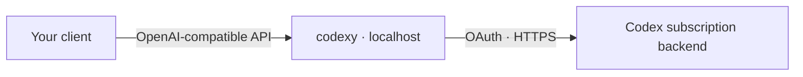

<p align="center">
  
</p>

<p align="center">
  <a href="https://github.com/smturtle2/codexy/actions/workflows/ci.yml"></a>
  <a href="https://github.com/smturtle2/codexy/releases/latest"></a>
  <a href="LICENSE"></a>
</p>

<p align="center">
  <a href="#quick-start">Quick start</a> ·
  <a href="#connect-a-client">Connect a client</a> ·
  <a href="#compatibility">Compatibility</a> ·
  <a href="docs/guide.md">Guide (한국어)</a> ·
  <a href="README.ko.md">한국어</a>
</p>

**codexy** is a local proxy that connects OpenAI-compatible clients to the Codex subscription backend. Sign in through your browser, start one Rust binary, and send requests to localhost.

- **Browser sign-in** — OAuth login without installing the Codex CLI.
- **Two familiar APIs** — Responses and Chat Completions, with text, function calls, and streaming.
- **A single binary** — prebuilt releases for Linux and macOS, on Intel/AMD and ARM64.
- **Session-aware caching** — forwards your cache key and exposes cached-token usage.

<p align="center">
  
</p>

## Quick start

Requires a ChatGPT account with access to the Codex subscription backend and your chosen model. codexy is an independent project and is not affiliated with OpenAI.

**1. Install** — Linux or macOS:

```sh
curl -fsSL https://raw.githubusercontent.com/smturtle2/codexy/main/scripts/install.sh | sh
```

The installer verifies SHA-256 and writes to `~/.local/bin`. Add that directory to your `PATH` if needed. You can also download a binary from [Releases](https://github.com/smturtle2/codexy/releases/latest).

**2. Sign in and start:**

```sh
codexy login
codexy serve
```

Keep this terminal open. The server listens on `127.0.0.1:8787`; stop it with `Ctrl+C`.

**3. Send a request** from another terminal:

```sh
curl http://127.0.0.1:8787/v1/responses \
  -H 'Content-Type: application/json' \
  -d '{"input":"Reply with exactly OK."}'
```

Omit `model` to use **`gpt-5.6-luna`**. Model availability depends on your account; change `default_model` in your [configuration](config.example.toml) when needed.

To update, run the same installer and restart `codexy serve`.

## Connect a client

| Setting | Value |
| --- | --- |
| Base URL | `http://127.0.0.1:8787/v1` |
| Model | `gpt-5.6-luna`, or a model available to your account |
| Local API key | Not required; if a client requires a nonempty value, use a placeholder such as `local` |

Local client credentials are not forwarded upstream. Keep the default loopback binding for local use; external access requires your own access control and TLS.

<details>
<summary>Chat Completions streaming example</summary>

```sh
curl -N http://127.0.0.1:8787/v1/chat/completions \
  -H 'Content-Type: application/json' \
  -d '{"messages":[{"role":"user","content":"Say hello."}],"stream":true,"stream_options":{"include_usage":true}}'
```

</details>

## How it works



codexy translates requests, manages OAuth credentials, and maps responses and usage. It preserves your session cache key: `prompt_cache_key` takes priority over the `session-id` header. Cache hits are controlled by the backend.

## Compatibility

| Capability | Support |
| --- | --- |
| Responses / Chat Completions | Text, function calls, streaming and nonstreaming |
| Responses string input | Normalized to an input array |
| Chat image / audio input | Not supported |
| `store:true`, `previous_response_id`, `conversation` | Rejected |
| Output-token limit parameters | Removed before forwarding; reported in a response header |
| Model discovery | Configured models only; no account-side discovery |
| Platforms | Linux GNU libc and macOS, x86_64 / aarch64 |

The subscription backend can change independently of codexy. See the [detailed behavior and limits](docs/guide.md), [verification results](docs/validation.md), and [latest fix validation](docs/input-error-fix-validation.md). These reference documents are currently in Korean.

## Configuration & documentation

Defaults work without a config file. To customize them, use [config.example.toml](config.example.toml) as a starting point:

```sh
codexy --config /path/to/config.toml serve
```

- [Operations, OAuth storage, configuration and API details](docs/guide.md)
- [Manual verification](docs/manual-verification.md)
- [Cache investigation](docs/cache-investigation.md)
- [Release history](https://github.com/smturtle2/codexy/releases)

## Development & contributing

Bug reports and focused pull requests are welcome. Include your OS, codexy version, and a minimal reproduction. Remove tokens and private prompt content before sharing logs.

```sh
cargo build --release --locked
cargo fmt --check
cargo clippy --locked --all-targets -- -D warnings
cargo test --locked --all-targets
sh tests/install.sh
```

CI uses mock credentials and a mock backend. Live verification scripts use your local account and are run separately.

## License

[European Union Public Licence 1.2](LICENSE) · [NOTICE](NOTICE)
